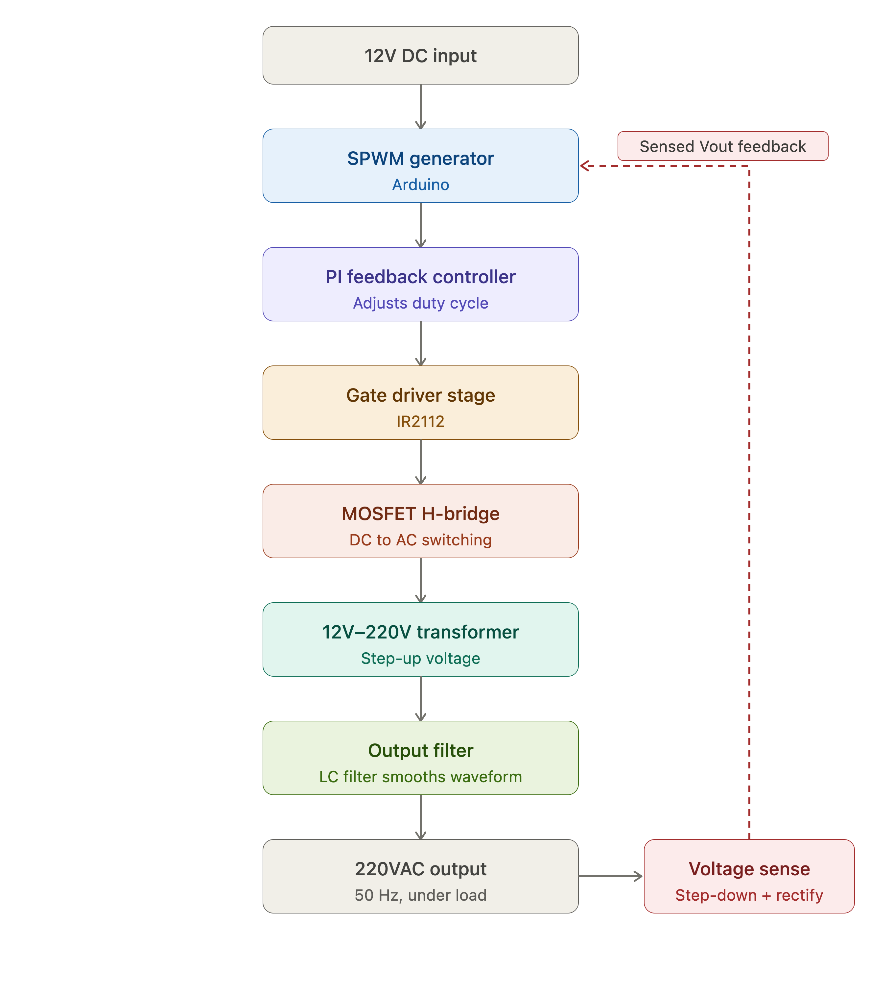

# Pure Sine Wave Inverter

A closed-loop pure sine wave inverter designed to convert a 12V DC source into a regulated 220VAC, 50Hz output using Sinusoidal Pulse Width Modulation (SPWM), MOSFET-based switching, and PI feedback control.

The project explores inverter control techniques, waveform synthesis, output regulation, and power electronics design for low-distortion AC power generation.

---

## Objective

The objective of this project was to design and validate a pure sine wave inverter capable of generating a stable 220VAC output from a 12V DC source while maintaining waveform quality and output voltage regulation through closed-loop control.

---

## System Architecture

---

## Hardware Components

- Arduino Microcontroller
- IR2112 Gate Driver
- 74LS08 Logic Gate IC
- IRF3205 Power MOSFETs
- H-Bridge Power Stage
- 12V–220V Transformer (Power Output Stage)
- 220V–12V Step-Down Feedback Transformer
- Output Filter Network
- Voltage Feedback Circuit
- Oscilloscope Measurement Interface

---

## Control Strategy

The inverter uses Sinusoidal Pulse Width Modulation (SPWM) to synthesize an AC waveform from a DC source.

A feedback signal from the output stage is continuously monitored and processed through a Proportional-Integral (PI) control loop. The controller adjusts the modulation characteristics to compensate for output voltage deviations and improve waveform stability under varying operating conditions.

---

## Engineering Contributions

* SPWM waveform generation
* PI feedback control implementation
* Power electronics design
* Gate driver integration
* H-bridge switching control
* Output voltage regulation
* Simulation and verification
* Hardware prototyping and testing

---

## Simulation Results

Simulation was performed to validate inverter operation, switching behavior, and output waveform quality before hardware implementation.

---

## Hardware Validation

Oscilloscope measurements were used to verify waveform generation and evaluate inverter performance during testing.

---

## Demonstration

Hardware Demonstration:
https://www.youtube.com/watch?v=baxVjNvxOzI

Simulation Demonstration:
https://www.youtube.com/watch?v=YOkIT0XrTNo

---

## Technologies

* Embedded C/C++
* Arduino
* SPWM
* PI Control
* Power Electronics
* H-Bridge Topology
* IR2112
* MOSFET Drivers
* Inverter Design
* Closed-Loop Control Systems
